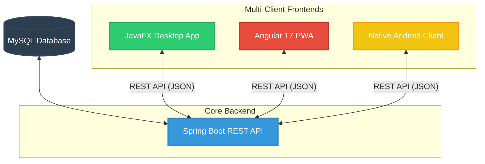

# 🎓 StudyFlow: Comprehensive Academic Management Ecosystem

**StudyFlow** is a modern, production-grade academic management ecosystem designed to help students streamline their academic life. Instead of relying on generic tools, StudyFlow is custom-tailored to the student workflowΓÇöcentralizing modules (subjects), assignments, exam schedules, and automatically calculating weighted averages.

The system is built on a **Service-Oriented Multi-Client Architecture**, where a single centralized RESTful API serves three specialized frontends: a **JavaFX Desktop App** for heavy home use, an **Angular 17 PWA** for quick web access with offline capabilities, and a native **Android Client** for ultimate mobility.

---

## 🏗️ System Architecture

All clients communicate with a central Spring Boot REST API, ensuring real-time synchronization across all platforms:



---

## 🚀 Core Features

### 🛡️ Secure Multi-User Environment
*   **Complete Isolation:** Every student has their own private space. Data is strictly filtered at the database query layer using the active user session ID, preventing unauthorized cross-user access.
*   **JWT & Sessions:** Secure authentication ensures that students can only pull or modify their own academic records.

### 📚 Subject & Module Organizer
*   **Custom Color Coding:** Organize subjects (e.g., *Access to Data*, *Systems Management*) with custom HSL/RGB colors. 
*   **Enhanced Contrast:** Uses a high-contrast dark text system paired with color borders to guarantee readability and web accessibility.

### 📝 Dynamic Task & Exam Management
*   **Strict Status Tracking:** Tasks are tracked with natural state labels (`Γ£ô HECHA` / `Γ£ù SIN HACER`) in green and gray, instead of confusing raw boolean values.
*   **Exam Scheduling:** Schedule upcoming exams, record classrooms, and keep track of types (e.g., Midterm, Final).

### 📈 Smart GPA & Average Calculator
*   **Weighted Grade Monitoring:** Enter individual grades with specific percentages (e.g., Theoretical exam 60%, Practice 40%).
*   **Real-time Computations:** The backend automatically calculates your overall GPA and individual subject weighted averages on-the-fly.

---

## 💻 Tech Stack

### Γÿò Backend (The Core)
*   **Framework:** Spring Boot 3.x
*   **Language:** Java 17 / 21
*   **Data Access:** Spring Data JPA / Hibernate ORM
*   **Database:** MySQL 8.x
*   **Hosting:** Deployed on Render

### 🖥️ Desktop Client
*   **Framework:** JavaFX 19
*   **Build Tool:** Maven
*   **Mappers:** Jackson Databind for robust JSON serialization

### 🌐 Web PWA (Progressive Web App)
*   **Framework:** Angular 17 (TypeScript)
*   **Design:** Custom Vanilla CSS & HSL palette (sleek dark/light theme)
*   **PWA support:** `@angular/pwa` for offline capability and local caching

### 📱 Android Client
*   **Language:** Native Kotlin & Java
*   **Design:** Material Design 3

---

## 🛠️ Security & Reliability Polish (Ver. 2.0)

This version addresses all pedagogical corrections and refactors the architecture for professional standards:
*   **Fixed API Data Sync (JSON Mappings):** Resolved a critical silent bug where completed task toggles would reset to unchecked upon refresh. By standardizing property mappings with `@JsonProperty("isCompleted")` on both the Spring Boot DTO and the clients, state synchronization is now 100% durable and robust.
*   **GUI Cleanup:** Removed all database technical IDs (such as `subjectId` or `taskId`) from the user-facing tables to adhere to strict UX guidelines and prevent potential database enumerations.
*   **ComboBox Object Dumps Fixed:** Resolved a bug in the "New Exam" view where the subject selector printed raw class dumps (e.g., `Subject(subjectId=...)`). JavaFX `StringConverter` has been explicitly implemented to show clean names.
*   **Readability Tweaks:** Standardized dark theme texts to ensure light-colored subject borders never compromise accessibility standards.

---

## 🗄️ Relational Database Schema

The database model is normalized and secure. Below is the relational structure:

| Table | Primary Key | Key Relations | Key Columns |
| :--- | :--- | :--- | :--- |
| **users** | `userId` (INT) | None | `userName`, `email`, `password` |
| **subjects** | `subjectId` (INT) | `userId` Γ₧ö **users** | `nameSubject`, `color`, `academicYear`, `activeSubject` |
| **tasks** | `taskId` (INT) | `subjectId` Γ₧ö **subjects** | `title`, `descriptionTask`, `due_date`, `isCompleted`, `priority` |
| **exams** | `examId` (INT) | `subjectId` Γ₧ö **subjects** | `nameExam`, `examType`, `examDate`, `classroom` |
| **grades** | `gradeId` (INT) | `subjectId` Γ₧ö **subjects** | `score` (DOUBLE), `weight` (DOUBLE) |

---

## 🚀 Running the Project Locally

### 1. Central Backend (API)
Ensure you have Java 17+ and Maven installed. Configure your MySQL credentials in `api/src/main/resources/application.properties`.
```bash
cd api
./mvnw spring-boot:run
```

### 2. Desktop Application (JavaFX)
Ensure your local backend is running or pointing to the remote server configured in `desktop/src/main/resources/config.properties`.
```bash
cd desktop
./mvnw clean javafx:run
```

### 3. Progressive Web App (Angular)
Ensure you have Node.js installed.
```bash
cd pwa
npm install
npm run start
```
Go to `http://localhost:4200` in your web browser.

---

## 👤 Author
*   **Juan Sebastián Valero Marulanda**
*   *Course:* 2┬║ DAM (Development of Multiplatform Applications)
*   *Module:* Proyecto Intermodular
*   *Institution:* IES Camp de Morvedre

---

### ☁️ Continuous Deployment
The PWA is automatically built and deployed via Netlify using the maestro `netlify.toml` file at the root of the repository, enabling seamless monorepo deployments directly from Git pushes.

